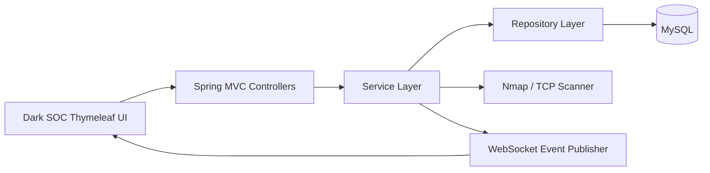

# AegisTrace


AegisTrace is a cybersecurity SOC and cyber-forensics web application built with Spring Boot, Thymeleaf, MySQL, and Spring Security. It keeps the existing dark cyber dashboard while making the operational data dynamic and database-driven.

## Features

- Role-protected SOC dashboard for administrators, analysts, and viewers
- Dynamic dashboard metrics sourced from persisted events, alerts, incidents, evidence, and scans
- Real scan execution with Nmap when available and TCP fallback when it is not
- Scan history API with search, deletion, and CSV export
- Automatic security events, exposure findings, and alerts when risky ports are discovered
- Live event stream over STOMP WebSockets
- Incident reconstruction and evidence vault pages backed by database records
- Global API error handling, validation, DTO-based scan APIs, and SLF4J logging
- Docker Compose setup with MySQL and Nmap-enabled application image
- GitHub Actions CI for Maven tests

## Demo Accounts

The development data loader creates:

| Username | Password | Role |
| --- | --- | --- |
| `admin` | `ChangeMe123!` | Administrator |
| `analyst` | `Analyst123!` | SOC Analyst |
| `viewer` | `Viewer123!` | Viewer |

## Architecture



More detail: [docs/architecture.md](docs/architecture.md)

## Run Locally

Make sure MySQL is running, then configure the database with environment variables or use the defaults in `application.properties`.

```powershell
$env:DB_URL="jdbc:mysql://localhost:3306/aegistrace_db?createDatabaseIfNotExist=true&useSSL=false&serverTimezone=UTC"
$env:DB_USERNAME="root"
$env:DB_PASSWORD="Root@123"
.\mvnw.cmd spring-boot:run
```

Open `http://localhost:8084/`.

## Docker

```powershell
Copy-Item .env.example .env
docker compose up --build
```

Then open `http://localhost:8084/`.

## REST API Highlights

| Method | Endpoint | Purpose |
| --- | --- | --- |
| `POST` | `/api/auth/login` | Generate JWT token |
| `POST` | `/api/scans/run` | Run a scan as Admin or Analyst |
| `GET` | `/api/scans?q=value` | Search scan history |
| `DELETE` | `/api/scans/{id}` | Delete scan as Admin |
| `GET` | `/api/scans/export.csv` | Export scan history |

## Folder Structure

```text
src/main/java/com/vaishnavi/aegistrace
  config/        Spring Security, WebSocket, seed data
  controller/    MVC and REST controllers
  dto/           API request/response objects
  entity/        JPA entities
  repository/    Spring Data repositories
  service/       Business logic and scanner orchestration
docs/            Architecture, schema, deployment notes
database/        Database notes and future migrations
screenshots/     Portfolio screenshots
demo/            Demo recordings or GIFs
```

## Database

The application uses MySQL in development and Docker. The current ER diagram is documented in [docs/database-schema.md](docs/database-schema.md).

## Security Notes

- Passwords are hashed with BCrypt.
- Role rules protect scan execution and destructive scan actions.
- API requests use DTO validation instead of binding directly to JPA entities.
- Database credentials are environment-driven for deployment.

## Roadmap

- Add Swagger/OpenAPI UI
- Add Flyway migrations
- Expand incident and evidence DTO APIs
- Add PDF and Excel report exports
- Add notification center and global search
- Add screenshot assets and demo GIF

## License

This project is licensed under the MIT License.
