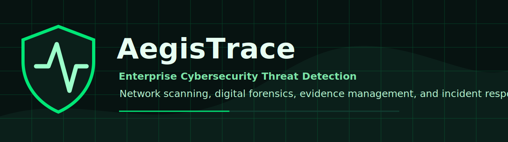
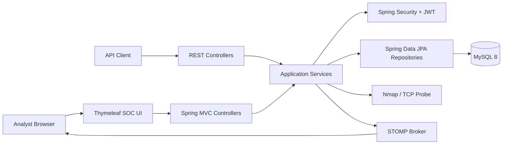
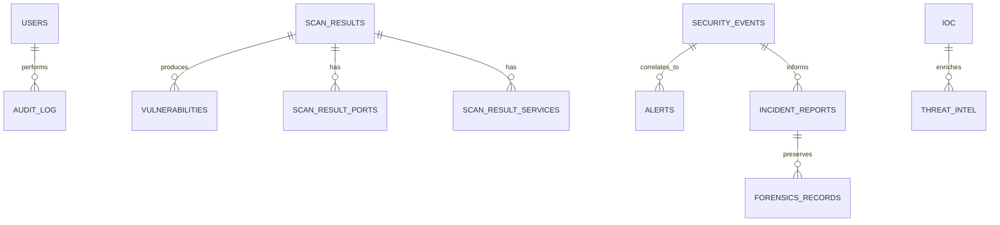
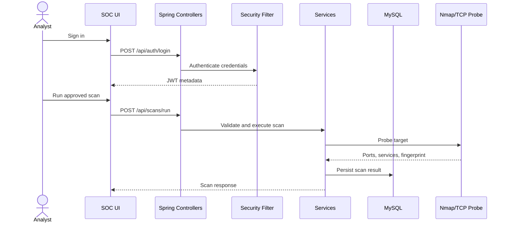
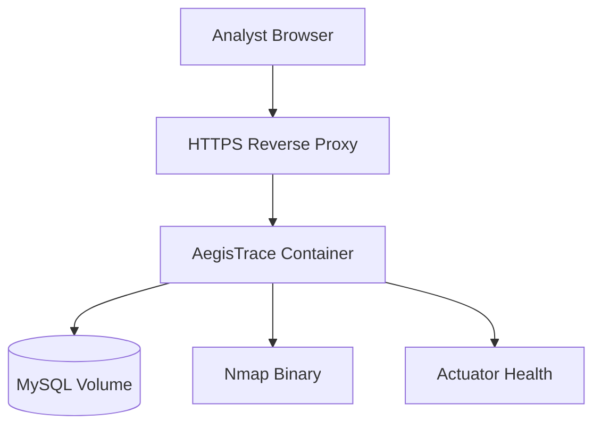
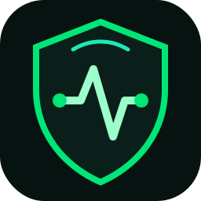

<div align="center">



# AegisTrace

### Enterprise Cybersecurity Threat Detection & Incident Response Platform


[](https://openjdk.org/projects/jdk/17/)
[](https://spring.io/projects/spring-boot)
[](https://www.mysql.com/)
[](https://maven.apache.org/)
[](docs/API.md)
[](docs/Security.md)
[](LICENSE)
[](.github/workflows/ci.yml)
[](https://github.com/Vaishnavi/AegisTrace/stargazers)
[](https://github.com/Vaishnavi/AegisTrace/network/members)
[](https://github.com/Vaishnavi/AegisTrace/issues)
[](https://github.com/Vaishnavi/AegisTrace/commits/main)
[](https://github.com/Vaishnavi/AegisTrace)

**Enterprise-grade SOC platform for threat detection, network scanning, digital forensics, evidence management, and incident response built using Spring Boot.**

[Overview](#overview) | [Features](#features) | [Architecture](#architecture) | [Quick Start](#quick-start) | [API](#api-documentation) | [Security](#security-features) | [Contributing](CONTRIBUTING.md)

</div>

> [!IMPORTANT]
> AegisTrace is a defensive cybersecurity project. Run scans only against systems you own or are explicitly authorized to assess.

## Overview

AegisTrace combines SOC operations, network exposure scanning, event ingestion, alert triage, digital evidence tracking, and incident response into one Spring Boot platform.

It is designed as a professional, portfolio-ready open-source repository: clear architecture, security-aware defaults, maintainable Java layers, reproducible build tooling, Docker deployment, CI automation, contribution workflows, and complete project documentation.

The application uses a dark cyber operations theme and keeps the existing UI intact. The repository polish focuses on maintainability, documentation, security posture, and contributor experience without removing current features or redesigning the interface.

## Project Identity

| Field | Value |
| --- | --- |
| Project | AegisTrace |
| Tagline | Enterprise Cybersecurity Threat Detection & Incident Response Platform |
| Category | SOC, SIEM-inspired operations, threat detection, forensics, incident response |
| Primary stack | Java 17, Spring Boot, MySQL, Thymeleaf, Spring Security |
| License | MIT |
| Audience | Recruiters, backend engineers, security engineers, SOC analysts, open-source contributors |

## Features

| Domain | Capability |
| --- | --- |
| SOC dashboard | Analyst-facing dashboard with risk score, events, alerts, scans, incidents, evidence, and tactic summaries |
| Network scanning | Nmap-backed target scanning with a bounded TCP fallback when Nmap is unavailable |
| Scan history | Persisted scans with search, delete authorization, CSV export, risk score, duration, ports, and services |
| Threat detection | Security event ingestion, risk scoring, MITRE tactic context, and real-time event publication |
| Alert management | Alert records with severity, details, source and destination context, and resolution workflow |
| Incident response | Incident reports with summary, impact analysis, remediation steps, and attack reconstruction support |
| Digital forensics | Evidence records with evidence ID, source, severity, summary, and chain-of-custody context |
| IOC management | Indicator-of-compromise CRUD for IPs, hashes, domains, categories, and descriptions |
| Threat intelligence | Threat intel records for IP reputation, malware family, country, and first-seen metadata |
| Authentication | BCrypt password hashing, JWT login, role-based method security, and stateless API access |
| Authorization | Admin, Analyst, and Viewer roles with protected scan execution, registration, and deletion paths |
| Realtime updates | STOMP over WebSocket for live `/topic/security-events` notifications |
| Operations | Dockerfile, Docker Compose, health endpoint, Maven Wrapper, CI workflow, and Dependabot config |

## Architecture



AegisTrace follows a conventional layered Spring architecture:

- `controller`: REST and MVC entry points
- `dto`: validated API contracts and response models
- `service`: application behavior and orchestration
- `repository`: Spring Data persistence boundaries
- `entity`: JPA persistence model
- `security`: JWT, filters, and role definitions
- `config`: security, WebSocket, and seed-data configuration
- `engine`: forensics and timeline reconstruction logic

For deeper diagrams, see [docs/Architecture.md](docs/Architecture.md).

## Technology Stack

| Layer | Technologies |
| --- | --- |
| Language | Java 17 |
| Framework | Spring Boot 3.5, Spring MVC, Spring Security, Spring Data JPA |
| UI | Thymeleaf, HTML, CSS, JavaScript |
| Database | MySQL 8.4 for runtime, H2 for tests |
| Auth | BCrypt, JWT, role-based method security |
| Realtime | Spring WebSocket, STOMP, SockJS |
| Scanner | Nmap integration with TCP fallback |
| Build | Maven Wrapper |
| Testing | JUnit 5, Mockito, AssertJ, Spring Boot Test |
| Runtime | Docker, Docker Compose |
| Automation | GitHub Actions, Dependabot |

## Folder Structure

```text
AegisTrace/
|-- .github/
|   |-- ISSUE_TEMPLATE/
|   |-- workflows/
|   |-- CODEOWNERS
|   |-- PULL_REQUEST_TEMPLATE.md
|   `-- dependabot.yml
|-- assets/
|   `-- brand/
|-- backend/
|-- config/
|-- database/
|-- demo/
|-- docs/
|-- frontend/
|-- screenshots/
|-- scripts/
|-- src/
|   |-- main/java/com/vaishnavi/aegistrace/
|   |-- main/resources/
|   `-- test/
|-- Dockerfile
|-- docker-compose.yml
|-- pom.xml
`-- README.md
```

The Maven application source remains under `src/` to preserve standard Spring Boot conventions. The `frontend/` and `backend/` folders document ownership boundaries for contributors while the current Thymeleaf UI and Java backend continue to build from the Maven layout.

## Quick Start

### Prerequisites

- Java 17 or newer
- Maven Wrapper from this repository
- MySQL 8 or Docker Desktop
- Nmap, optional but recommended
- Git

### Run with Docker Compose

```bash
cp .env.example .env
docker compose up --build
```

Open:

```text
http://localhost:8084
```

### Run Locally on Windows

```powershell
$env:DB_URL="jdbc:mysql://localhost:3306/aegistrace_db?createDatabaseIfNotExist=true&useSSL=false&serverTimezone=UTC"
$env:DB_USERNAME="aegistrace"
$env:DB_PASSWORD="replace-this-value"
.\mvnw.cmd spring-boot:run
```

### Run Locally on Linux or macOS

```bash
export DB_URL="jdbc:mysql://localhost:3306/aegistrace_db?createDatabaseIfNotExist=true&useSSL=false&serverTimezone=UTC"
export DB_USERNAME="aegistrace"
export DB_PASSWORD="replace-this-value"
./mvnw spring-boot:run
```

## Configuration

| Variable | Purpose | Default |
| --- | --- | --- |
| `DB_URL` | JDBC connection string | Local MySQL URL |
| `DB_USERNAME` | Database username | `root` in local profile |
| `DB_PASSWORD` | Database password | Development fallback |
| `JPA_DDL_AUTO` | Hibernate schema mode | `update` |
| `JPA_SHOW_SQL` | SQL logging toggle | `false` |
| `NMAP_ENABLED` | Enables Nmap scanner path | `true` |
| `ACTUATOR_ENDPOINTS` | Exposed actuator endpoints | `health,info` |

Production deployments should provide all secrets through environment variables, vault integrations, or orchestration-level secret stores.

## Development Accounts

The current non-test data loader creates development accounts for local evaluation:

| Username | Password | Role |
| --- | --- | --- |
| `admin` | `ChangeMe123!` | `ROLE_ADMIN` |
| `analyst` | `Analyst123!` | `ROLE_ANALYST` |
| `viewer` | `Viewer123!` | `ROLE_VIEWER` |

> [!WARNING]
> These accounts are for local demonstration only. Replace them before exposing any environment to a network.

## Usage

1. Sign in as an administrator or analyst.
2. Review dashboard risk, event, alert, incident, scan, and evidence summaries.
3. Run authorized scans against owned or approved targets.
4. Review scan ports, services, status, risk, and duration.
5. Create or inspect incidents and evidence records.
6. Use CSV export for scan history handoff.
7. Monitor live events through WebSocket-backed dashboard updates.

## API Documentation

Authentication:

```bash
curl -X POST http://localhost:8084/api/auth/login \
  -H "Content-Type: application/json" \
  -d '{"username":"analyst","password":"Analyst123!"}'
```

Run a scan:

```bash
curl -X POST http://localhost:8084/api/scans/run \
  -H "Authorization: Bearer <token>" \
  -H "Content-Type: application/json" \
  -d '{"target":"scanme.nmap.org"}'
```

Selected endpoints:

| Method | Path | Purpose | Authorization |
| --- | --- | --- | --- |
| `POST` | `/api/auth/login` | Authenticate and return JWT metadata | Public |
| `POST` | `/api/auth/register` | Register a user | Admin |
| `POST` | `/api/scans/run` | Execute target scan | Admin, Analyst |
| `GET` | `/api/scans` | List or search scans | Authenticated |
| `DELETE` | `/api/scans/{id}` | Delete scan record | Admin |
| `GET` | `/api/scans/export.csv` | Export scan history | Authenticated |
| `GET` | `/api/events` | List security events | Authenticated |
| `POST` | `/api/events` | Create security event | Authenticated |
| `GET` | `/api/alerts` | List alerts | Authenticated |
| `POST` | `/api/alerts/{id}/resolve` | Resolve alert | Authenticated |
| `GET` | `/api/incidents` | List incidents | Authenticated |
| `POST` | `/api/incidents` | Create incident | Authenticated |
| `GET` | `/api/evidence` | List evidence | Authenticated |
| `POST` | `/api/evidence` | Create evidence | Authenticated |
| `GET` | `/api/iocs` | List IOCs | Authenticated |
| `POST` | `/api/iocs` | Create IOC | Authenticated |
| `DELETE` | `/api/iocs/{id}` | Delete IOC | Authenticated |
| `GET` | `/api/threats` | List threat intel | Authenticated |
| `POST` | `/api/threats` | Create threat intel | Authenticated |

Full reference: [docs/API.md](docs/API.md).

## Database Design

Primary tables:

- `users`
- `security_events`
- `event_logs`
- `alerts`
- `scan_results`
- `scan_result_ports`
- `scan_result_services`
- `vulnerabilities`
- `incident_reports`
- `forensics_records`
- `ioc`
- `threat_intel`
- `audit_log`



See [docs/Database.md](docs/Database.md) and [database/schema.sql](database/schema.sql).

## Workflow



Operational workflow details: [docs/Workflow.md](docs/Workflow.md).

## Deployment

Supported deployment paths:

- Local Java process with MySQL
- Docker Compose for app plus MySQL
- Containerized application behind a reverse proxy
- Future Kubernetes deployment profile



Deployment guide: [docs/Deployment.md](docs/Deployment.md).

## Screenshots

Publication screenshots belong in [screenshots/](screenshots/README.md).

| Screen | File |
| --- | --- |
| Dashboard | `screenshots/dashboard.png` |
| Login | `screenshots/login.png` |
| Incident response | `screenshots/incident.png` |
| Evidence vault | `screenshots/evidence.png` |
| Scan history | `screenshots/scan-history.png` |
| Settings | `screenshots/settings.png` |
| Analytics | `screenshots/analytics.png` |

The repository currently provides naming, redaction, and capture guidance. Add real screenshots only after running the application locally and redacting sensitive values.

## GIF Demo

Demo media belongs in [demo/](demo/README.md).

Expected release assets:

- `demo/demo.gif`
- `demo/demo.mp4`

The demo should show login, dashboard review, scan execution against an authorized target, scan history, incident triage, and evidence review.

## Security Features

- Stateless API security with JWT bearer tokens
- HTTP Basic support for operational testing
- BCrypt password hashing
- Method-level role checks for privileged actions
- Admin-only registration endpoint
- Inactive account rejection through `CustomUserDetailsService`
- Password hash serialization protection
- Actuator exposure limited to health and info by default
- `.env` and secret file ignore rules
- Responsible disclosure process in [SECURITY.md](SECURITY.md)

Security architecture: [docs/Security.md](docs/Security.md).

## Performance

Current performance posture:

- Bounded scanner fallback avoids unbounded network waits.
- Database-backed dashboard reduces static or duplicated state.
- `spring.jpa.open-in-view=false` avoids long-lived persistence contexts in web rendering.
- Maven CI verifies build and tests on every push and pull request.

Future performance work:

- Pagination for high-volume events, scans, alerts, incidents, and evidence.
- Database indexes for search-heavy fields.
- Async scan jobs for long-running targets.
- Metrics dashboards through Micrometer and Prometheus.

## Known Issues

- Database migrations are not yet versioned with Flyway or Liquibase.
- OpenAPI/Swagger documentation is not yet generated from code.
- Demo screenshots and videos must be captured from a real local run.
- Seed data is useful for portfolio review but should be disabled in hardened deployments.
- Fine-grained authorization should be expanded across all write endpoints.

## Roadmap

- [ ] Add OpenAPI 3 documentation.
- [ ] Introduce Flyway migrations.
- [ ] Add pagination and filtering DTOs.
- [ ] Add integration tests for controller authorization.
- [ ] Add async scan queue and job status model.
- [ ] Add exportable incident reports.
- [ ] Add Prometheus metrics.
- [ ] Add production profile without seed accounts.
- [ ] Publish signed v1.0.0 GitHub release.

Full roadmap: [docs/Roadmap.md](docs/Roadmap.md).

## Quality Bar

AegisTrace is maintained against a recruiter-facing release bar covering repository structure, documentation, architecture, backend, frontend, UI, security, maintainability, portfolio presentation, and overall professionalism.

Current audit: [docs/QualityAudit.md](docs/QualityAudit.md).

## Contributing

Contributions are welcome when they improve defensive security capability, maintainability, tests, documentation, or operational safety.

Start here:

- [CONTRIBUTING.md](CONTRIBUTING.md)
- [CODE_OF_CONDUCT.md](CODE_OF_CONDUCT.md)
- [docs/DeveloperGuide.md](docs/DeveloperGuide.md)
- [docs/CodingStandards.md](docs/CodingStandards.md)

## Release v1.0.0

The repository is prepared for a `v1.0.0` release with MIT licensing, changelog, security policy, Code of Conduct, contribution guide, CI workflow, Dependabot, and draft release notes in [docs/Release-v1.0.0.md](docs/Release-v1.0.0.md).

## Repository Settings

Suggested description, topics, social preview guidance, and branch-protection recommendations are documented in [docs/RepositorySettings.md](docs/RepositorySettings.md).

## FAQ

| Question | Answer |
| --- | --- |
| Is AegisTrace a SIEM? | It is SIEM-inspired and scoped as a Spring Boot SOC operations platform. |
| Can I scan public targets? | Only scan systems you own or are explicitly authorized to test. |
| Does it require Nmap? | Nmap is recommended; a bounded TCP probe can be used as fallback. |
| Is it production-ready? | The repository is production-shaped, but deployment hardening still requires secrets management, TLS, migrations, and least privilege. |
| Why keep Thymeleaf? | The existing UI is stable and aligned with the current Spring Boot architecture. |

## Acknowledgements

- Spring Boot and the Spring ecosystem
- Nmap for network discovery
- MITRE ATT&CK for adversary behavior taxonomy
- Open-source maintainers who model excellent project stewardship
- Defensive security practitioners building safer systems

## References

- [Spring Boot](https://spring.io/projects/spring-boot)
- [Spring Security](https://spring.io/projects/spring-security)
- [Spring Data JPA](https://spring.io/projects/spring-data-jpa)
- [Nmap](https://nmap.org/)
- [MITRE ATT&CK](https://attack.mitre.org/)
- [Keep a Changelog](https://keepachangelog.com/)
- [Semantic Versioning](https://semver.org/)

---

<div align="center">



**AegisTrace** protects the investigation trail from signal to evidence.

Made for defensive security, responsible research, and maintainable engineering.

</div>
