# Database

AegisTrace uses Spring Data JPA with MySQL for runtime persistence and H2 for test execution.

## Entity Relationship Diagram

```mermaid
erDiagram
    USERS {
        bigint id PK
        string username UK
        string role
        string email UK
        string password
        string status
        datetime created_at
    }
    SECURITY_EVENTS {
        bigint id PK
        datetime timestamp
        string sourceip
        string destinationip
        string username
        string event_type
        string severity
        string description
        string status
        string mitre_tactic
        double risk_score
        string raw_log
    }
    EVENT_LOGS {
        bigint id PK
        string sourceip
        string destinationip
        string event_type
        string severity
        double risk_score
        datetime timestamp
        string raw_log
    }
    ALERTS {
        bigint id PK
        datetime timestamp
        string alert_type
        string severity
        string sourceip
        string destinationip
        string detail
        boolean resolved
    }
    SCAN_RESULTS {
        bigint id PK
        string target
        string domain
        datetime timestamp
        string os_fingerprint
        double risk_score
        string status
        bigint duration_millis
        string scanner_user
        string result_summary
    }
    SCAN_RESULT_PORTS {
        bigint scan_result_id FK
        string port
    }
    SCAN_RESULT_SERVICES {
        bigint scan_result_id FK
        string service
    }
    VULNERABILITIES {
        bigint id PK
        string name
        string severity
        string description
        string recommendation
        bigint scan_result_id FK
    }
    INCIDENT_REPORTS {
        bigint id PK
        string title
        datetime created_at
        double risk_score
        string summary
        string impact_analysis
        string remediation_steps
    }
    FORENSICS_RECORDS {
        bigint id PK
        string evidence_id
        string source
        datetime timestamp
        string severity
        string summary
        string chain_of_custody
    }
    IOC {
        bigint id PK
        string type
        string value
        string category
        string description
    }
    THREAT_INTEL {
        bigint id PK
        string ip_address
        string threat_level
        string country
        string malware_family
        string description
        datetime first_seen
    }
    AUDIT_LOG {
        bigint id PK
        datetime event_time
        string actor
        string action
        string details
    }

    SCAN_RESULTS ||--o{ SCAN_RESULT_PORTS : has
    SCAN_RESULTS ||--o{ SCAN_RESULT_SERVICES : has
    SCAN_RESULTS ||--o{ VULNERABILITIES : produces
```

## Schema Management

The current application uses Hibernate `ddl-auto=update` for local development convenience. Production deployments should introduce Flyway or Liquibase before schema changes are promoted.

Recommended production posture:

- Use `JPA_DDL_AUTO=validate`.
- Manage DDL through reviewed migrations.
- Back up data before migration.
- Add indexes for search-heavy fields.
- Avoid storing raw secrets or unredacted sensitive evidence.

## Reference SQL

See [../database/schema.sql](../database/schema.sql) for a documented baseline schema that mirrors the current entity model.
