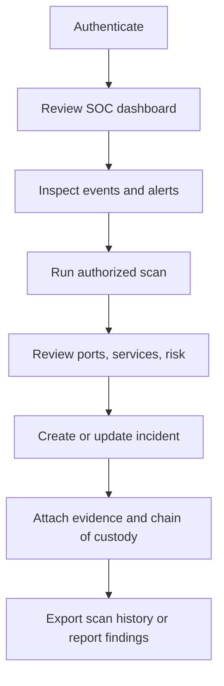
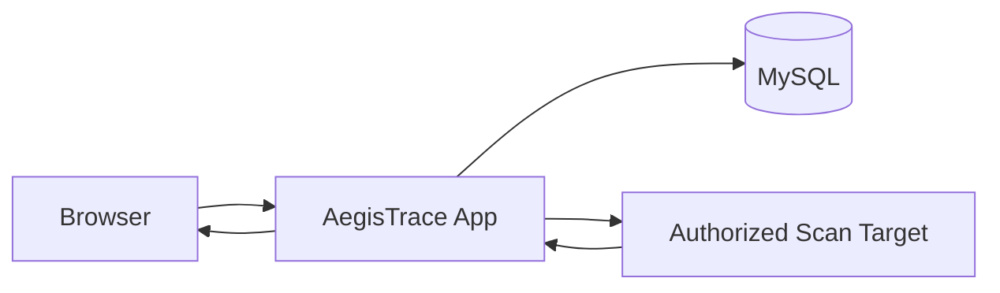
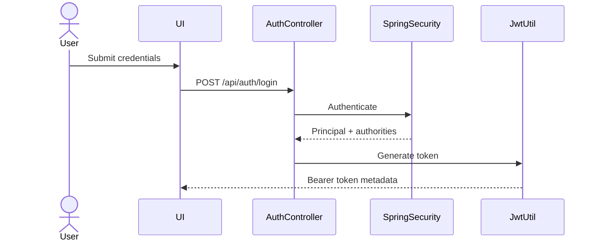
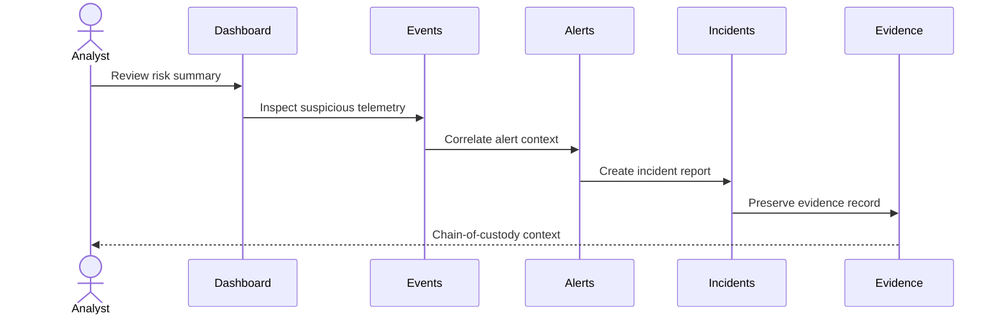

# Workflow

## Analyst Workflow

```mermaid
flowchart TB
    Login[Authenticate] --> Dashboard[Review SOC dashboard]
    Dashboard --> Events[Inspect events and alerts]
    Events --> Scan[Run authorized scan]
    Scan --> Findings[Review ports, services, risk]
    Findings --> Incident[Create or update incident]
    Incident --> Evidence[Attach evidence and chain of custody]
    Evidence --> Export[Export scan history or report findings]
```

## Network Flow

```mermaid
flowchart LR
    Browser --> App[AegisTrace App]
    App --> DB[(MySQL)]
    App --> Target[Authorized Scan Target]
    Target --> App
    App --> Browser
```

## Authentication Flow

```mermaid
sequenceDiagram
    actor User
    participant UI
    participant AuthController
    participant SpringSecurity
    participant JwtUtil

    User->>UI: Submit credentials
    UI->>AuthController: POST /api/auth/login
    AuthController->>SpringSecurity: Authenticate
    SpringSecurity-->>AuthController: Principal + authorities
    AuthController->>JwtUtil: Generate token
    JwtUtil-->>UI: Bearer token metadata
```

## Incident Response Flow

```mermaid
sequenceDiagram
    actor Analyst
    participant Dashboard
    participant Events
    participant Alerts
    participant Incidents
    participant Evidence

    Analyst->>Dashboard: Review risk summary
    Dashboard->>Events: Inspect suspicious telemetry
    Events->>Alerts: Correlate alert context
    Alerts->>Incidents: Create incident report
    Incidents->>Evidence: Preserve evidence record
    Evidence-->>Analyst: Chain-of-custody context
```
