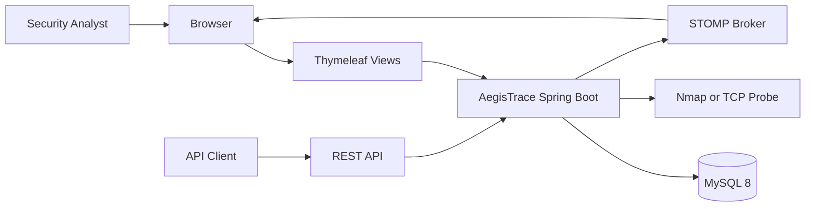
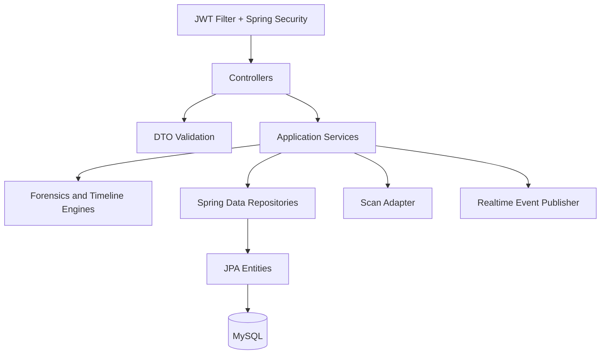
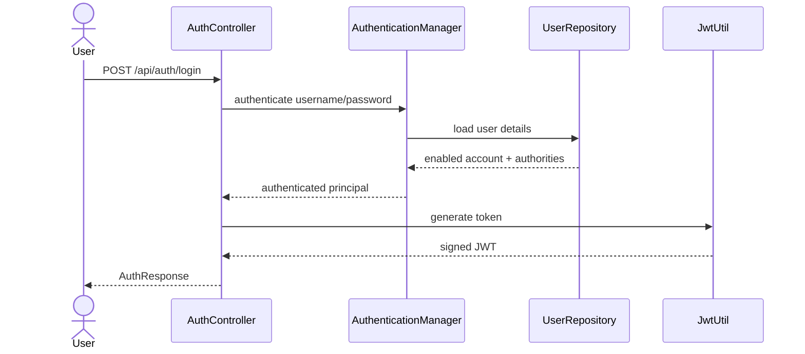
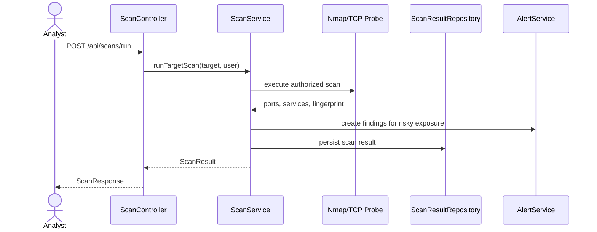
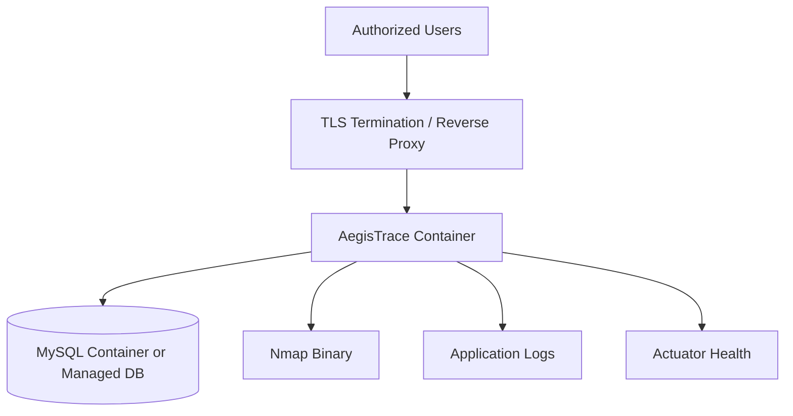

# Architecture

AegisTrace is a layered Spring Boot SOC platform. The application combines server-rendered operations pages, REST APIs, WebSocket updates, JPA persistence, and scanner orchestration behind Spring Security.

## System Context

## Runtime Components

## Layer Responsibilities

| Layer | Responsibility |
| --- | --- |
| `controller` | Accept HTTP requests, apply endpoint contracts, return DTOs or views |
| `dto` | Keep API payloads explicit and validation-ready |
| `service` | Own business workflows, scan orchestration, alerting, event handling, authentication |
| `repository` | Encapsulate persistence through Spring Data JPA |
| `entity` | Represent relational state and schema ownership |
| `security` | JWT generation, token filtering, and roles |
| `engine` | Domain-specific reconstruction and forensics helpers |
| `config` | Security, WebSocket, seed data, and infrastructure beans |

## Authentication Flow

## Scan Flow

## Deployment Diagram

## Design Principles

- Keep controllers thin and service-oriented.
- Keep API payloads in DTOs instead of binding directly to entities.
- Treat scanner execution as privileged defensive functionality.
- Keep seed/demo data away from test profile and disable it for hardened deployments.
- Prefer versioned migrations before production schema evolution.
- Add tests around security-sensitive behavior before broad feature work.
