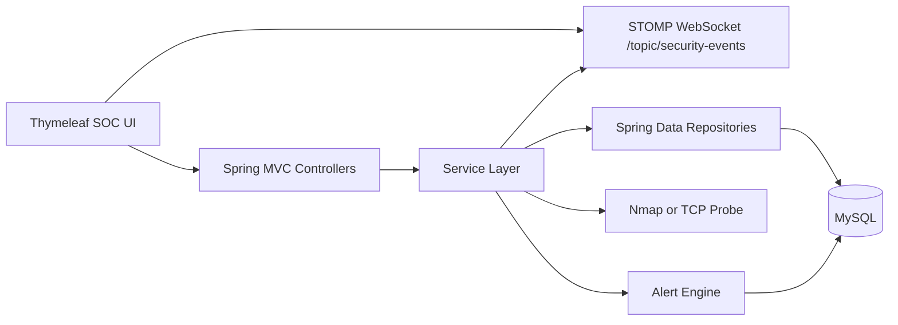

# Architecture

AegisTrace is a Spring Boot MVC application backed by MySQL. Thymeleaf renders the existing dark SOC pages, while REST APIs power scan execution and operational data access.

## Layers

- Controller layer: validates requests, applies role rules, returns DTOs or views.
- Service layer: owns scan orchestration, alert creation, events, risk scoring, and audit-friendly logging.
- Repository layer: persists normalized SOC entities through Spring Data JPA.
- UI layer: keeps the existing dark cyber theme and receives live event updates over WebSockets.
