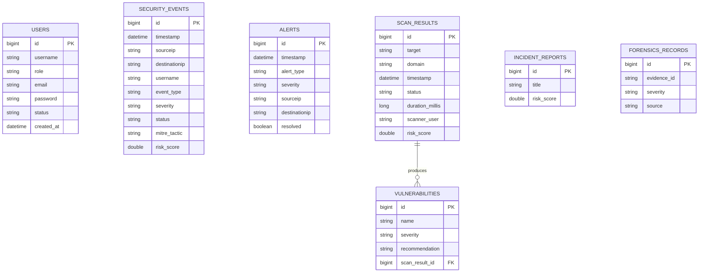

# Database Schema

```mermaid
erDiagram
    USERS {
        bigint id PK
        string username
        string role
        string email
        string password
        string status
        datetime created_at
    }
    SECURITY_EVENTS {
        bigint id PK
        datetime timestamp
        string sourceip
        string destinationip
        string username
        string event_type
        string severity
        string status
        string mitre_tactic
        double risk_score
    }
    ALERTS {
        bigint id PK
        datetime timestamp
        string alert_type
        string severity
        string sourceip
        string destinationip
        boolean resolved
    }
    SCAN_RESULTS {
        bigint id PK
        string target
        string domain
        datetime timestamp
        string status
        long duration_millis
        string scanner_user
        double risk_score
    }
    VULNERABILITIES {
        bigint id PK
        string name
        string severity
        string recommendation
        bigint scan_result_id FK
    }
    INCIDENT_REPORTS {
        bigint id PK
        string title
        double risk_score
    }
    FORENSICS_RECORDS {
        bigint id PK
        string evidence_id
        string severity
        string source
    }
    SCAN_RESULTS ||--o{ VULNERABILITIES : produces
```
